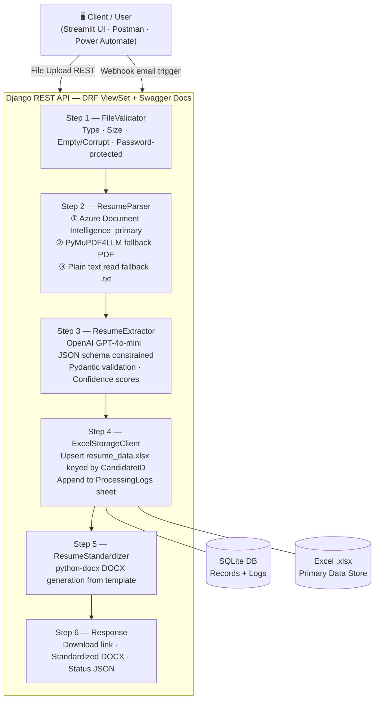

# Technical Document: Resume Parsing & Standardization Agent

> **Assignment:** Build a Resume Parsing & Standardization Agent  
> **Date:** March 9, 2026

---

## Table of Contents

1. [System Design & Architecture](#1-system-design--architecture)
2. [Prompts & Extraction Schema](#2-prompts--extraction-schema)
3. [Connectors & Integrations Used](#3-connectors--integrations-used)
4. [Limitations & Considerations](#4-limitations--considerations)
5. [How to Run](#5-how-to-run)

---

## 1. System Design & Architecture

### 1.1 Agent Implementation Choice & Justification

The assignment supports three implementation paths (Copilot Studio, Azure OpenAI + Logic Apps, or Power Apps + AI Builder). Due to unavailability of a Microsoft 365 Business account (required for Copilot Studio, Power Automate, Dataverse, and AI Builder), this system was implemented using:

**Django REST Framework + OpenAI GPT-4o-mini + Excel Storage**

Every functional requirement of the assignment is met:

| Assignment Requirement | Our Implementation |
|---|---|
| Resume ingestion via upload | Django REST API (`MultiPartParser`) |
| Resume ingestion via email | Webhook endpoint (`/api/v1/webhook/power-automate/`) compatible with Power Automate HTTP triggers |
| File validation | `FileValidator` service — type, size, readability, password-protection detection |
| AI-powered extraction | OpenAI GPT-4o-mini with structured JSON schema |
| Data storage | Excel (`.xlsx`) via `openpyxl` — mirrors Excel on OneDrive/SharePoint |
| Standardized resume output | `.docx` generation via `python-docx` |
| Processing logs & audit | SQLite DB + Excel `ProcessingLogs` sheet |
| Duplicate handling | CandidateID-based upsert (MD5 hash of email+phone) |
| API documentation | Swagger/OpenAPI at `/swagger/` |

The Excel schema and webhook endpoint are designed for a **direct migration path to SharePoint/Dataverse** once Microsoft licensing is available.

---

### 1.2 High-Level Architecture



---

### 1.3 Application Stack

| Layer | Technology | Purpose |
|---|---|---|
| Backend Framework | Django 4 + Django REST Framework | API server, routing, models, admin |
| AI / LLM | OpenAI GPT-4o-mini | Resume information extraction |
| Document Parsing | Azure AI Document Intelligence SDK | Layout-aware text extraction (primary) |
| Document Parsing | PyMuPDF4LLM (`pymupdf4llm`) | PDF text fallback |
| DOCX Generation | python-docx | Standardized resume output |
| Data Storage | Excel `.xlsx` via `openpyxl` | Primary data store (mirrors SharePoint/OneDrive) |
| Local DB | SQLite | Processing records, audit logs, status tracking |
| Frontend / UI | Streamlit | Demo UI for testing the end-to-end pipeline |
| API Docs | drf-yasg (Swagger / ReDoc) | Interactive API documentation |

---

### 1.4 Processing Pipeline (Step-by-Step Flow)

```
Client uploads file
        │
        ▼
┌───────────────────┐
│  Step 1 — VALIDATE│  FileValidator
│                   │  • Check file exists, non-empty
│                   │  • Validate extension (.pdf, .doc,
│                   │    .docx, .rtf, .txt, .png, .jpg)
│                   │  • Check file size ≤ 10 MB
│                   │  • Detect password-protected files
│                   │  • Detect empty/corrupt files
└────────┬──────────┘
         │ Valid? No → Return 400 + error message
         │ Yes
         ▼
┌───────────────────┐
│  Step 2 — PARSE   │  ResumeParser
│                   │  Primary: Azure Document Intelligence
│                   │   (prebuilt-layout model)
│                   │  Fallback: PyMuPDF4LLM (PDFs)
│                   │  Fallback: Plain text read (.txt)
│                   │  → Raw text + page count
└────────┬──────────┘
         │
         ▼
┌───────────────────┐
│  Step 3 — EXTRACT │  ResumeExtractor (OpenAI GPT-4o-mini)
│                   │  • System prompt + JSON schema
│                   │  • temperature=0.1 (deterministic)
│                   │  • Pydantic validation & normalisation
│                   │  • Field alias resolution
│                   │  • Confidence score calculation
│                   │  • CandidateID hash generation
└────────┬──────────┘
         │
         ▼
┌───────────────────┐
│  Step 4 — STORE   │  ExcelStorageClient
│                   │  • Upsert row in resume_data.xlsx
│                   │  • Key: CandidateID (email+phone MD5)
│                   │  • Duplicate → update + bump version
│                   │  • Append run to ProcessingLogs sheet
│                   │  • Save JSON blob to SQLite ResumeRecord
└────────┬──────────┘
         │
         ▼
┌───────────────────┐
│  Step 5 — STANDARD│  ResumeStandardizer
│                   │  • python-docx DOCX generation
│                   │  • Standard template (7 sections)
│                   │  • Consistent Calibri font, styling
│                   │  • Saved to outputs/ directory
└────────┬──────────┘
         │
         ▼
    Return response
    {record_id, status, download_url, confidence}
```

---

### 1.5 Duplicate Handling

When the same resume is re-submitted:
- `CandidateID` (MD5 hash of `email + phone`) is used as the unique key.
- If a matching record already exists, the Excel row is **updated in-place** and the `Version` column is incremented.
- The `previous_version_id` in SQLite captures the chain of submissions.
- All processing runs are logged to the `ProcessingLogs` sheet with timestamps regardless of duplicate status.

---

### 1.6 API Endpoints

| Method | Endpoint | Purpose |
|---|---|---|
| `POST` | `/api/v1/resumes/` | Upload and process a resume |
| `GET` | `/api/v1/resumes/` | List all records (paginated, filterable) |
| `GET` | `/api/v1/resumes/{id}/` | Single record detail |
| `GET` | `/api/v1/resumes/{id}/status_check/` | Polling for processing status |
| `GET` | `/api/v1/resumes/{id}/download/` | Download standardized DOCX |
| `GET` | `/api/v1/resumes/{id}/extracted_data/` | Raw extracted JSON |
| `GET` | `/api/v1/resumes/{id}/text_preview/` | Plain-text resume preview |
| `GET` | `/api/v1/resumes/{id}/logs/` | Processing audit logs |
| `GET` | `/api/v1/health/` | API health check |
| `GET` | `/api/v1/schema/` | Excel schema / data dictionary |
| `POST` | `/api/v1/webhook/power-automate/` | Email-triggered ingestion (Power Automate compatible) |
| `GET` | `/swagger/` | Interactive Swagger API docs |
| `GET` | `/redoc/` | ReDoc API docs |

---

### 1.7 Standardized Resume Template Structure

The output `.docx` follows the required template exactly:

1. **Header** — Full Name (large, bold, centred) | Phone | Email | Location | LinkedIn | GitHub
2. **Professional Summary** — Factual 3–5 line summary from actual experience and skills. No fabrication.
3. **Key Skills** — Bulleted list, grouped by category where possible (Power Platform / Data / Programming / Tools)
4. **Work Experience** — Company – Role | Dates | 3–6 bullets of responsibilities and achievements (reverse chronological)
5. **Education** — Degree, Institution, Year (reverse chronological)
6. **Certifications** — Optional; only if present in original resume
7. **Projects** — Optional; only if present in original resume
8. **Declaration / Personal details** — NOT added unless explicitly present in the original resume

Output format: `.docx` (Word) with consistent Calibri font, section dividers, and professional styling.

---

## 2. Prompts & Extraction Schema

### 2.1 Extraction JSON Schema (Pydantic — `ResumeData`)

The system defines a strict Pydantic model that acts as the **extraction contract** between the codebase and the LLM. The LLM must return a flat JSON object that conforms to this schema.

#### Top-Level Fields

| Field | Type | Description |
|---|---|---|
| `candidate_full_name` | `str` | Full name of the candidate |
| `email_ids` | `list[str]` | One or more email addresses |
| `phones` | `list[str]` | One or more phone numbers (with country code if present) |
| `gender` | `str` | Gender — only if **explicitly stated**; never inferred from name |
| `current_location` | `str` | City / State / Country as written |
| `geo_details` | `GeoDetails` | Normalised `{city, state, country}` object |
| `total_experience` | `str` | Total years/months of experience |
| `work_experience` | `list[WorkExperience]` | Array of structured work experience entries |
| `key_skills` | `list[str]` | Flat list of individual skills |
| `education` | `list[Education]` | Array of structured education entries |
| `certifications` | `list[str]` | Flat list of certification names (strings only) |
| `linkedin_url` | `str` | Full LinkedIn URL |
| `github_url` | `str` | Full GitHub URL |
| `portfolio_url` | `str` | Portfolio / website URL |
| `professional_summary` | `str` | Factual 3–5 line summary |
| `projects` | `list[Project]` | Key projects if present in original |
| `languages_known` | `list[str]` | Spoken/written languages |
| `field_confidences` | `dict[str, float]` | Per-field confidence score (0.0–1.0) |
| `candidate_id` | `str` | MD5 hash of email+phone — server-generated, not from LLM |

#### Nested Model: `WorkExperience`

| Field | Type | Description |
|---|---|---|
| `company` | `str` | Employer / company name |
| `role` | `str` | Job title / designation |
| `location` | `str` | Office location if mentioned |
| `start_date` | `str` | Employment start date (e.g. `"Jan 2020"`) |
| `end_date` | `str` | Employment end date (e.g. `"Present"`) |
| `duration` | `str` | Calculated or stated duration |
| `responsibilities` | `list[str]` | Individual responsibility bullets |
| `achievements` | `list[str]` | Quantified or impact-focused achievements |
| `technologies` | `list[str]` | Specific tools/languages/frameworks for this role |

#### Nested Model: `Education`

| Field | Type | Description |
|---|---|---|
| `degree` | `str` | Exact qualification name (e.g. `"B.Tech"`, `"MBA"`) |
| `field_of_study` | `str` | Major / specialization / stream |
| `institution` | `str` | University, college, or school name |
| `start_year` | `str` | Four-digit start year |
| `end_year` | `str` | Four-digit end / passing year |
| `grade` | `str` | CGPA, percentage, or grade as written |

#### Nested Model: `GeoDetails`

| Field | Type | Description |
|---|---|---|
| `city` | `str` | City name |
| `state` | `str` | State or province |
| `country` | `str` | Country name |

#### Nested Model: `Project`

| Field | Type | Description |
|---|---|---|
| `name` | `str` | Project name |
| `description` | `str` | Description of the project |
| `technologies` | `list[str]` | Technologies used |

---

### 2.2 System Prompt

The following system prompt is sent to the LLM for every extraction call. Designed to be **deterministic and strictly non-fabricating**:

```
You are an expert resume parser AI. Your task is to extract structured information from resume text.

CRITICAL — always output a FLAT JSON object with these exact top-level keys.
Do NOT nest contact details under 'personal_info' or any other wrapper key.
Required top-level keys: candidate_full_name, email_ids, phones, gender,
current_location, linkedin_url, github_url, portfolio_url, total_experience,
work_experience, key_skills, education, certifications, languages_known,
professional_summary, projects, geo_details, field_confidences.

RULES:
1. Extract ONLY information explicitly present in the resume text. Never fabricate or infer data.
2. If a field is missing from the resume, return an empty string "" or empty array [].
3. CONTACT INFO (top priority): Always extract candidate_full_name, email_ids, phones,
   current_location from the header/contact section.
4. For gender: ONLY extract if explicitly stated. Do NOT infer from names.
5. For phone numbers: include country code if present. Return as a flat array of strings.
6. For certifications: return a flat array of strings (just the certification name/title).
   Example: ["AWS Certified Developer", "PMP"] — not [{"name": "..."}].
7. For languages_known: return as array of strings e.g. ["English", "French"].
8. WORK EXPERIENCE — CRITICAL:
   a. company: extract the COMPANY/EMPLOYER NAME for every role.
   b. role: exact job title as written in the resume.
   c. start_date / end_date: extract employment dates. NEVER leave empty if mentioned.
   d. duration: calculate if start and end dates are present.
   e. responsibilities: each distinct responsibility as a separate list item.
   f. achievements: quantified or impact-focused statements.
   g. technologies: specific tools, languages, frameworks mentioned in that role.
   h. List in reverse chronological order.
9. For education: list ALL qualifications in reverse chronological order.
   degree / field_of_study / institution / start_year / end_year / grade.
10. For skills: list each distinct skill as its own entry (no label prefixes).
11. For professional_summary: factual 3-5 line summary. No exaggeration.
12. For total_experience: extract if stated; otherwise calculate from work history dates.
13. Scan the FULL resume including bottom sections. Do NOT stop at work experience.
14. For URL fields: extract the FULL URL. If only a label is present without URL, return "".
15. For geo_details: parse current_location into {city, state, country}.
16. Provide confidence scores (0.0-1.0) per field in field_confidences:
    - 1.0  = clearly and explicitly stated
    - 0.7-0.9 = present but partially ambiguous
    - 0.3-0.6 = inferred from context
    - 0.0-0.2 = not found or highly uncertain

Return ONLY valid JSON. No markdown fences, no explanation.
```

---

### 2.3 LLM Configuration

| Parameter | Value | Rationale |
|---|---|---|
| Model | `gpt-4o-mini` | Best balance of accuracy and cost for structured extraction |
| Temperature | `0.1` | Near-deterministic output; reduces hallucination risk |
| Max Tokens | `12,000` | Accommodates complex multi-page resumes |
| Response Format | `{"type": "json_object"}` | Enforces JSON-only output at the API level |
| Max Input | `35,000 chars` | Truncates very large files to prevent token overflow |

---

### 2.4 Confidence Scoring

Each extracted field receives a confidence score from `0.0` to `1.0`:

| Score Range | Meaning |
|---|---|
| `1.0` | Clearly and explicitly stated in the resume |
| `0.7 – 0.9` | Present but partially ambiguous or formatted inconsistently |
| `0.3 – 0.6` | Inferred from surrounding context |
| `0.0 – 0.2` | Not found or highly uncertain |

**Server-side validation rules applied after the LLM response:**
- Empty field → confidence forced to `0.0` regardless of LLM score
- Non-empty field with LLM score `< 0.1` → bumped to `0.3` minimum (data is present)
- Optional fields (`linkedin_url`, `github_url`, `certifications`, `gender`) with `0.0` score are excluded from the overall average to avoid penalizing resumes that legitimately omit those fields

---

### 2.5 Candidate ID Generation

A unique `CandidateID` is generated server-side (not by the LLM):

- **Input:** `email_ids[0].lower() + phones[0]`
- **Method:** MD5 hash, truncated to 16 hex characters
- **Fallback:** MD5 of `candidate_full_name` if both email and phone are absent
- **Usage:** Upsert key in Excel and deduplication key in SQLite

---

## 3. Connectors & Integrations Used

### 3.1 OpenAI API

- **Purpose:** Core LLM engine for resume data extraction
- **Model:** `gpt-4o-mini`
- **SDK:** `openai` Python package (`openai.OpenAI`)
- **Configuration:** Environment variable `OPENAI_API_KEY`
- **Interaction Pattern:** Single `chat.completions.create` call per resume with structured system prompt and `response_format={"type": "json_object"}`
- **Fallback Behaviour:** If the API key is not configured, the extractor logs a warning and the pipeline fails at Step 3 with status `FAILED`. No regex fallback is used.

### 3.2 Azure AI Document Intelligence

- **Purpose:** Primary document text extraction — handles multi-column PDFs, tables, scanned images, DOCX, and complex formatting
- **Model Used:** `prebuilt-layout` — layout-aware model that preserves reading order
- **SDK:** `azure-ai-documentintelligence` (`azure.ai.documentintelligence.DocumentIntelligenceClient`)
- **Configuration:** Environment variables:
  - `AZURE_DOCUMENT_INTELLIGENCE_ENDPOINT`
  - `AZURE_DOCUMENT_INTELLIGENCE_KEY`
- **Supported File Types:** `.pdf`, `.docx`, `.doc`, `.jpg`, `.jpeg`, `.png`, `.bmp`, `.tiff`
- **Fallback Behaviour:** If not configured, or if the service returns fewer than 20 characters, the system falls back to PyMuPDF4LLM (for PDFs) or plain text read (for `.txt` files).

### 3.3 Power Automate Webhook (Inbound)

- **Purpose:** Email-based ingestion — a Power Automate flow can forward an email attachment to this endpoint to trigger resume processing without a manual upload
- **Endpoint:** `POST /api/v1/webhook/power-automate/`
- **Input Format:**
  ```json
  {
    "file_content": "<base64-encoded file bytes>",
    "file_name": "resume.pdf",
    "source": "email",
    "sender_email": "applicant@example.com"
  }
  ```
- **Status:** Live and functional. Shaped as a direct drop-in for Power Automate HTTP action connectors.

### 3.4 Excel Storage (`openpyxl`)

- **Purpose:** Primary data store for all extracted resume fields (equivalent to Excel on OneDrive/SharePoint)
- **Library:** `openpyxl`
- **File Location:** Configured via `EXCEL_OUTPUT_PATH` (default: `outputs/resume_data.xlsx`)
- **Sheets:**
  - `Resume Data` — one row per candidate, upserted by `CandidateID`
  - `ProcessingLogs` — append-only audit log for every processing step

### 3.5 SQLite (Local Metadata)

- **Purpose:** Tracks processing status, stores extracted JSON blob, and maintains audit logs
- **Models:** `ResumeRecord`, `ProcessingLog`, `ExtractionField`
- **Used For:** Status polling (`/status_check/`), log retrieval (`/logs/`), DOCX download path

---

## 4. Limitations & Considerations

### 4.1 Vendor & API Dependency

- The system depends on the **OpenAI API** for all intelligent extraction. If the API is unavailable or rate-limited, the entire extraction step fails — there is no production-grade fallback.
- **Azure Document Intelligence** is optional but strongly recommended. Without it, the parser relies on PyMuPDF4LLM which may produce lower-quality text for complex layouts (two-column, tables).

### 4.2 Cost

- **OpenAI GPT-4o-mini:** ~`$0.01–$0.05` per resume at typical lengths. High-volume usage will accumulate costs.
- **Azure Document Intelligence:** Billed per page. A free tier of 500 pages/month is available; beyond that, standard pricing applies.

### 4.3 LLM Output Quality

- Despite schema enforcement and a strict prompt at `temperature=0.1`, the LLM may occasionally:
  - Miss a company name in unconventional resume layouts
  - Misparse date ranges for overlapping roles
  - Return an overly verbose `professional_summary`
- **Mitigation:** Pydantic post-validation corrects type mismatches and resolves field aliases. Per-field confidence scores flag low-certainty extractions for human review.

### 4.4 File Format Coverage

- **Fully supported:** `.pdf`, `.docx`, `.doc`, `.txt`, `.rtf`, `.jpg`, `.jpeg`, `.png` when Azure Document Intelligence is configured
- **Without Azure DI:** Only `.pdf` (PyMuPDF4LLM) and `.txt` (plain read) have reliable fallback. `.doc`, `.docx`, `.rtf` will fail at the parsing step.

### 4.5 Language & Formatting

- Optimized for **English-language resumes**. Mixed-language resumes (e.g., Hindi section headings with English content) may yield partial extraction.
- Infographic-style or heavily graphic resumes may produce poor text extraction even with Azure DI.

### 4.6 No Microsoft 365 Integration (Current State)

- **Dataverse**, **SharePoint Lists**, and **Copilot Studio** integrations are not implemented due to the absence of a Microsoft 365 Business license.
- The Excel storage schema, webhook shape, and JSON extraction contract are all designed for **direct migration to the Microsoft stack** without changes to the extraction logic.

Migration map:

| Current | Future (with M365 license) |
|---|---|
| Django REST API | Power Apps front-end |
| OpenAI GPT API | Azure OpenAI Service |
| Local Excel (`.xlsx`) | Excel on SharePoint / Dataverse |
| Webhook endpoint | Power Automate HTTP trigger |
| Local file system | SharePoint Document Library |

### 4.7 Security

- No authentication is implemented by default (suitable for development/demo only).
- API keys are loaded from `.env` and must not be committed to version control.
- Uploaded files are stored on the local filesystem (`uploads/`). In production, replace with Azure Blob Storage or equivalent secure cloud storage.

### 4.8 Performance

- Typical processing time per resume: **15–45 seconds** (Azure DI parsing + LLM extraction)
- The API call blocks until the full pipeline completes — no async processing
- For production scale, the pipeline should be decoupled using a task queue (e.g., Celery + Redis)

---

## 5. How to Run

### 5.1 Prerequisites

| Requirement | Detail |
|---|---|
| Python | 3.10 or higher |
| pip | Latest version recommended |
| OpenAI API Key | Required for extraction |
| Azure Document Intelligence | Optional — recommended for complex PDFs |

---

### 5.2 Setup Instructions

**Step 1 — Clone the Repository**

```bash
git clone <repository-url> resume_parser
cd resume_parser
```

**Step 2 — Create and Activate a Virtual Environment**

```bash
python -m venv .venv

# Windows
.venv\Scripts\activate

# macOS / Linux
source .venv/bin/activate
```

**Step 3 — Install Dependencies**

```bash
pip install -r requirements.txt
```

**Step 4 — Configure Environment Variables**

Create a `.env` file in the project root:

```env
# Required
OPENAI_API_KEY=sk-...

# Optional — Azure Document Intelligence (strongly recommended for complex PDFs)
AZURE_DOCUMENT_INTELLIGENCE_ENDPOINT=https://<your-resource>.cognitiveservices.azure.com/
AZURE_DOCUMENT_INTELLIGENCE_KEY=<your-key>

# Optional — override defaults
OPENAI_MODEL=gpt-4o-mini
MAX_FILE_SIZE_MB=10
DJANGO_DEBUG=True
```

**Step 5 — Apply Database Migrations**

```bash
python manage.py migrate
```

---

### 5.3 Running the Application

**Option A — Django REST API (Backend only)**

```bash
python manage.py runserver
```

- API base URL: `http://localhost:8000/api/v1/`
- Swagger UI: `http://localhost:8000/swagger/`
- ReDoc: `http://localhost:8000/redoc/`

**Option B — Streamlit Demo UI**

```bash
streamlit run streamlit_app.py
```

Opens a browser-based interface to upload resumes and view extraction results end-to-end without using the raw API.

---

### 5.4 Processing a Resume via the API

**Upload and process a resume:**

```bash
curl -X POST http://localhost:8000/api/v1/resumes/ \
  -F "file=@resume.pdf" \
  -F "source=upload"
```

**Sample successful response:**

```json
{
  "record_id": "550e8400-e29b-41d4-a716-446655440000",
  "status": "completed",
  "candidate_name": "John Doe",
  "confidence": 0.91,
  "download_url": "/api/v1/resumes/550e8400.../download/"
}
```

**Download the standardized DOCX:**

```bash
curl -O http://localhost:8000/api/v1/resumes/<record_id>/download/
```

**Check processing status:**

```bash
curl http://localhost:8000/api/v1/resumes/<record_id>/status_check/
```

**View extracted data:**

```bash
curl http://localhost:8000/api/v1/resumes/<record_id>/extracted_data/
```

**View processing audit logs:**

```bash
curl http://localhost:8000/api/v1/resumes/<record_id>/logs/
```

---

### 5.5 Output Files

| File | Location | Description |
|---|---|---|
| Extracted data (Excel) | `outputs/resume_data.xlsx` | Primary data store — one row per candidate |
| Standardized DOCX | `outputs/Standardized_Resume_<name>_<ts>.docx` | Generated output resume |
| LLM raw JSON | `outputs/llm_raw_<name>_<ts>.json` | Raw LLM response for debugging/audit |
| Application log | `resume_parser.log` | Application-level log file |
| SQLite database | `db.sqlite3` | Records, logs, and status tracking |

---

### 5.6 Error Handling Reference

| Error Scenario | System Response |
|---|---|
| Unsupported file type | `400` — error message listing supported types |
| File size > 10 MB | `400` — size limit error |
| Password-protected file | `400` — password-protected file detected |
| Empty / corrupt file | `400` — file contains no readable text |
| No OpenAI API key configured | Pipeline fails at Step 3 with status `FAILED`; error logged |
| Azure DI unavailable | Falls back to PyMuPDF4LLM / plain text; warning logged |
| LLM JSON parse error | Empty extraction returned; status `FAILED`; error logged |
| All core fields empty after extraction | Warning logged; pipeline continues; low overall confidence score |
| Duplicate resume submitted | Existing record updated; version incremented; no duplicate row created |
