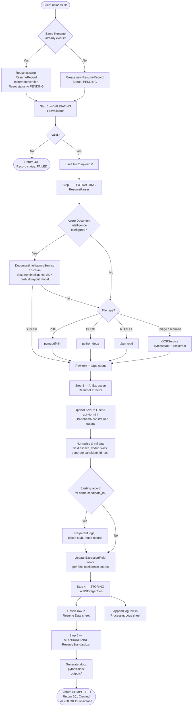
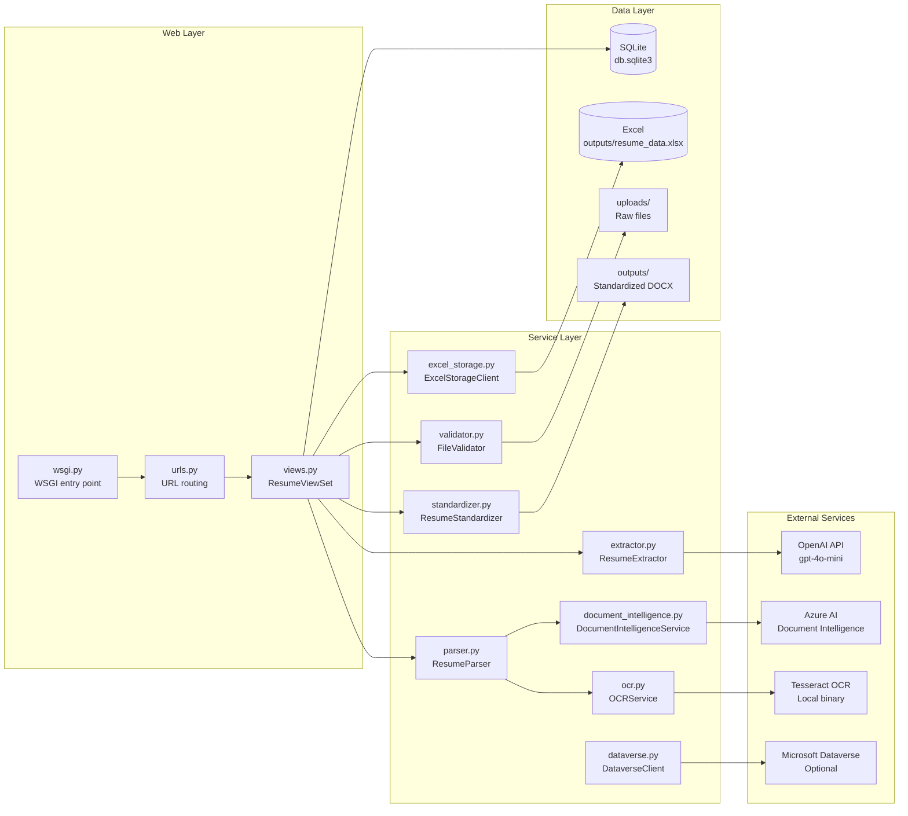
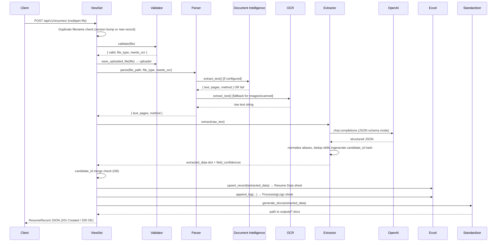
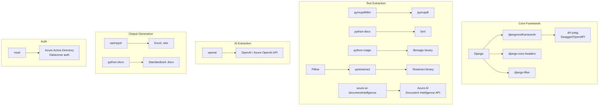

# Resume Parser — Backend Architecture

> **Stack:** Python 3 · Django 4 · Django REST Framework · OpenAI GPT-4o · Azure AI Document Intelligence · Tesseract OCR · openpyxl · python-docx · SQLite

---

## 1. System Overview

```
                        ┌─────────────────────────────────┐
                        │         External Clients         │
                        │  Browser / Power Automate / API  │
                        └───────────────┬─────────────────┘
                                        │ HTTP
                        ┌───────────────▼─────────────────┐
                        │         Django (WSGI)            │
                        │   resume_parser/wsgi.py          │
                        │   Gunicorn / Django dev server   │
                        └───────────────┬─────────────────┘
                                        │
                        ┌───────────────▼─────────────────┐
                        │           URL Router             │
                        │  resume_parser/urls.py           │
                        │  api/urls.py  (DRF DefaultRouter)│
                        └───────────────┬─────────────────┘
                                        │
                 ┌──────────────────────┼──────────────────────┐
                 │                      │                       │
    ┌────────────▼──────┐  ┌────────────▼──────┐  ┌───────────▼──────────┐
    │  ResumeViewSet    │  │  health_check()   │  │ power_automate_      │
    │  (CRUD + actions) │  │  data_dictionary()│  │ webhook()            │
    │  api/views.py     │  │  api/views.py     │  │ api/views.py         │
    └────────────┬──────┘  └───────────────────┘  └──────────────────────┘
                 │
    ┌────────────▼──────────────────────────────────────────────────────┐
    │                    6-Step Processing Pipeline                      │
    │  1. Validate → 2. Parse → 3. Extract → 4. Store → 5. Standardize  │
    └───────────────────────────────────────────────────────────────────┘
```

---

## 2. Request Routes

| Method | URL | Handler | Purpose |
|--------|-----|---------|---------|
| `POST` | `/api/v1/resumes/` | `ResumeViewSet.create` | Upload & process a resume |
| `GET` | `/api/v1/resumes/` | `ResumeViewSet.list` | List all records (paginated, filterable) |
| `GET` | `/api/v1/resumes/{id}/` | `ResumeViewSet.retrieve` | Single record detail |
| `GET` | `/api/v1/resumes/{id}/status_check/` | `ResumeViewSet.status_check` | Polling endpoint for UI |
| `GET` | `/api/v1/resumes/{id}/download/` | `ResumeViewSet.download` | Download standardized DOCX |
| `GET` | `/api/v1/resumes/{id}/extracted_data/` | `ResumeViewSet.extracted_data` | Raw extracted JSON |
| `GET` | `/api/v1/resumes/{id}/text_preview/` | `ResumeViewSet.text_preview` | Plain-text resume preview |
| `GET` | `/api/v1/resumes/{id}/logs/` | `ResumeViewSet.logs` | Processing audit logs |
| `GET` | `/api/v1/health/` | `health_check` | API health check |
| `GET` | `/api/v1/schema/` | `data_dictionary` | Excel schema / data dictionary |
| `POST` | `/api/v1/webhook/power-automate/` | `power_automate_webhook` | Email-triggered ingestion |
| `GET` | `/swagger/` | drf-yasg | Interactive API docs (Swagger UI) |
| `GET` | `/redoc/` | drf-yasg | Alternative API docs (ReDoc) |

---

## 3. Processing Pipeline (Step-by-Step)



---

## 4. Component Map



---

## 5. Component Reference

### 5.1 Web Layer

#### `resume_parser/wsgi.py` — WSGI Entry Point
- Standard Django WSGI adapter; production entry point for Gunicorn/uWSGI.
- Sets `DJANGO_SETTINGS_MODULE` and hands off to the Django application.

#### `resume_parser/urls.py` — Root URL Router
- Mounts the API under `/api/v1/` via `include("api.urls")`.
- Registers Swagger UI (`/swagger/`) and ReDoc (`/redoc/`) via **drf-yasg**.
- Serves uploaded media and static files in `DEBUG` mode.

#### `api/urls.py` — API URL Router
- Uses DRF `DefaultRouter` to register `ResumeViewSet` on `/api/v1/resumes/`.
- Registers three standalone function views: `health_check`, `data_dictionary`, `power_automate_webhook`.

#### `api/views.py — ResumeViewSet` (core orchestrator)
- Inherits `ModelViewSet`; provides list, retrieve, upload, status polling, download, text preview, and log retrieval.
- `create()` is the main pipeline controller — calls every service in sequence, persists status at each step, rolls back to `FAILED` on any exception.
- **Duplicate handling:** checks for same filename at upload time (version increment + record reuse); also merges on matching `candidate_id` post-extraction.
- `_log()` writes a `ProcessingLog` DB row **and** appends to the Excel `ProcessingLogs` sheet simultaneously.

---

### 5.2 Service Layer

#### `api/services/validator.py — FileValidator`
**Why it exists:** Prevents malicious or unsupported files from entering the pipeline.

- Checks MIME type against `MIME_TYPE_MAP` using `python-magic` (binary content inspection, not extension spoofing).
- Enforces `MAX_FILE_SIZE_BYTES` (default 10 MB).
- Sets `needs_ocr = True` for image formats (`.png`, `.jpg`).
- Saves the uploaded file to `uploads/` using a UUID-based filename to avoid collisions.
- Returns a structured `dict`: `{ valid, errors, file_type, needs_ocr }`.

#### `api/services/parser.py — ResumeParser`
**Why it exists:** Different file formats require completely different extraction strategies; this service picks the best one automatically.

| Priority | Method | Used when |
|----------|--------|-----------|
| 1 (primary) | `DocumentIntelligenceService` | Azure endpoint + key configured **and** file type supported |
| 2 (fallback) | `pymupdf4llm` | `.pdf` — text, tables, multi-column layouts |
| 2 (fallback) | `python-docx` | `.docx` |
| 2 (fallback) | Plain read | `.txt`, `.rtf` |
| 3 (final fallback) | `OCRService` | Images or scanned PDFs where text extraction yields insufficient content |

Returns a unified `dict`: `{ text, pages, method, success, error }`.

#### `api/services/document_intelligence.py — DocumentIntelligenceService`
**Why it exists:** Azure AI Document Intelligence uses ML layout models with far higher accuracy than local PDF libraries, especially for complex multi-column or scanned PDFs.

- Uses `azure-ai-documentintelligence` SDK with the `prebuilt-layout` model.
- Supports: `.pdf`, `.docx`, `.jpg`, `.jpeg`, `.png`, `.bmp`, `.tiff`, `.pptx`, `.xlsx`.
- Gracefully degrades: if `AZURE_DOCUMENT_INTELLIGENCE_ENDPOINT` / `AZURE_DOCUMENT_INTELLIGENCE_KEY` are absent, `is_available` returns `False` and the parser skips it automatically.

#### `api/services/ocr.py — OCRService`
**Why it exists:** Final fallback for scanned files and images where no digital text layer exists.

- Wraps **pytesseract** (Python binding to Tesseract OCR binary).
- Pre-processes images with PIL: grayscale conversion, contrast enhancement, sharpening — significantly improves OCR accuracy.
- Configured via `TESSERACT_CMD` setting (path to local Tesseract binary).
- Gracefully degrades: if pytesseract is not installed, `available` is `False`.

#### `api/services/extractor.py — ResumeExtractor`
**Why it exists:** Raw text from a resume is unstructured; the LLM converts it into a guaranteed-schema JSON object with confidence scores for every field.

Key design decisions:
- **JSON Schema Contract** (`EXTRACTION_SCHEMA`): Forces the LLM to return a specific structure with `response_format={"type": "json_object"}`, eliminating hallucinated field names.
- **Field aliases** (`WORK_EXP_ALIASES`, `EDU_ALIASES`): Normalise variant LLM key names (e.g., `"designation"` → `"role"`, `"university"` → `"institution"`) for downstream compatibility.
- **Candidate ID generation**: MD5 hash of `email + phone` (first 16 hex chars) creates a stable, anonymous deduplication key.
- **Per-field confidence scores**: LLM returns a `field_confidences` object (0.0–1.0); fields below 0.3 are flagged as missing in `ExtractionField`.
- **Overall confidence**: Mean of all field confidence scores, or field-presence ratio as fallback.
- Uses `OPENAI_MODEL` (default `gpt-4o-mini`) via the standard `openai` SDK; works with both OpenAI and Azure OpenAI endpoints.

#### `api/services/excel_storage.py — ExcelStorageClient`
**Why it exists:** Provides a durable, human-readable tabular store for all parsed resume data without requiring a database server.

**Sheets:**

| Sheet | Content |
|-------|---------|
| `Resume Data` | One row per candidate — 24 columns covering all extracted fields |
| `ProcessingLogs` | Append-only audit log — 8 columns: Timestamp, RecordID, CandidateID, FileName, Level, Step, Message, Details |

- **Upsert logic** (`upsert_record`): opens the workbook once, finds an existing row by `CandidateID` (column A), updates it in place; otherwise appends a new row. Increments `Version` on update.
- **`append_log`**: called by `_log()` for every pipeline step — gives a full Excel-native audit trail alongside the DB log.
- Styled headers (dark fill, white bold text, frozen top row, fixed column widths) for immediate readability.
- Path configured via `EXCEL_OUTPUT_PATH` setting (defaults to `outputs/resume_data.xlsx`).

#### `api/services/standardizer.py — ResumeStandardizer`
**Why it exists:** Produces a clean, consistently formatted DOCX that HR teams can use directly, regardless of how the original resume was laid out.

**DOCX sections generated:**

| # | Section | Source fields |
|---|---------|---------------|
| 1 | **Header** | `candidate_full_name`, `phones`, `email_ids`, `current_location`, `linkedin_url`, `github_url` |
| 2 | **Professional Summary** | `professional_summary` |
| 3 | **Key Skills** | `key_skills` — grouped by category (Power Platform / Programming / Data & Analytics / Cloud & DevOps / Other) |
| 4 | **Work Experience** | `work_experience[].company/role/start_date/end_date/duration/responsibilities/achievements/technologies` |
| 5 | **Education** | `education[].degree/field_of_study/institution/start_year/end_year/grade` |
| 6 | **Certifications** | `certifications[]` (optional) |
| 7 | **Projects** | `projects[].name/description/technologies` — max 3 (optional) |

Also provides `generate_text_output()` for plain-text preview (used by `/text_preview/` endpoint).
Output saved to `outputs/` as `Standardized_Resume_{Name}_{timestamp}.docx`.

#### `api/services/dataverse.py — DataverseClient`
**Why it exists:** Optional integration layer for organisations using Microsoft Power Platform / Dynamics 365 — pushes processed resume data into a Dataverse custom table.

- Uses **MSAL** with the OAuth 2.0 Client Credentials flow for service-to-service authentication.
- Caches the access token until expiry to minimise token round-trips.
- `is_configured` checks all four required env vars; if any are absent the client silently skips.
- **Currently inactive** — configured in settings, fully implemented, ready for activation.

---

### 5.3 Data Layer

#### Django Models (`api/models.py`)

```
ResumeRecord                      ProcessingLog                 ExtractionField
─────────────────────────         ──────────────────────────    ──────────────────────
id (UUID PK)                      id (UUID PK)                  id (auto)
candidate_id (unique, indexed)    resume_record (FK → cascade)  resume_record (FK)
original_file_name                level (info/warning/error)    field_name
file_type                         step                          field_value
file_size_bytes                   message                       confidence (0.0–1.0)
file_path                         details (JSON)                is_missing (< 0.3)
resume_source                     timestamp
extracted_data (JSON)
extraction_confidence
status (7-state enum)
error_message
dataverse_record_id
standardized_file_path
created_at / updated_at / processed_at
version
previous_version_id
```

**`ResumeRecord`** — Master tracking row. One per candidate (deduplicated by `candidate_id`). Status progresses through `PENDING → VALIDATING → EXTRACTING → STORING → STANDARDIZING → COMPLETED` (or `FAILED` at any step).

**`ProcessingLog`** — Immutable audit entries. Created by `_log()` at every pipeline transition. Queryable via `/logs/` endpoint and mirrored to Excel's `ProcessingLogs` sheet.

**`ExtractionField`** — Per-field granularity. Enables confidence dashboards, field-level re-extraction tracking, and quality reporting.

#### Storage Directories

| Path | Purpose |
|------|---------|
| `db.sqlite3` | Django ORM — `ResumeRecord`, `ProcessingLog`, `ExtractionField` |
| `uploads/` | Raw uploaded resume files (UUID-named, original preserved) |
| `outputs/resume_data.xlsx` | Primary data store — extracted structured data (Resume Data + ProcessingLogs sheets) |
| `outputs/Standardized_Resume_*.docx` | Generated standardized resumes |
| `resume_parser.log` | Rolling text log (Django logging framework) |

---

## 6. Data Flow — Sequence Diagram



---

## 7. Configuration Reference (`.env`)

| Variable | Default | Purpose |
|----------|---------|---------|
| `DJANGO_SECRET_KEY` | dev key | Django secret key — **change in production** |
| `DJANGO_DEBUG` | `True` | Debug mode |
| `DJANGO_ALLOWED_HOSTS` | `localhost,127.0.0.1` | Allowed host headers |
| `OPENAI_API_KEY` | — | **Required** — OpenAI API key for extraction |
| `OPENAI_MODEL` | `gpt-4o-mini` | LLM model used for extraction |
| `AZURE_DOCUMENT_INTELLIGENCE_ENDPOINT` | — | Optional — Azure DI endpoint URL |
| `AZURE_DOCUMENT_INTELLIGENCE_KEY` | — | Optional — Azure DI API key |
| `TESSERACT_CMD` | `C:\Program Files\Tesseract-OCR\tesseract.exe` | Path to Tesseract binary |
| `EXCEL_OUTPUT_PATH` | `outputs/resume_data.xlsx` | Path to Excel output file |
| `MAX_FILE_SIZE_MB` | `10` | Upload size limit |
| `UPLOAD_DIR` | `uploads` | Directory for raw uploaded files |
| `STANDARDIZED_OUTPUT_DIR` | `outputs` | Directory for generated DOCX files |
| `DATAVERSE_URL` | — | Optional — Dataverse environment URL |
| `DATAVERSE_CLIENT_ID` | — | Optional — Azure AD App client ID |
| `DATAVERSE_CLIENT_SECRET` | — | Optional — Azure AD App client secret |
| `DATAVERSE_TENANT_ID` | — | Optional — Azure AD tenant ID |
| `DATAVERSE_TABLE_NAME` | `cr_resumedata` | Dataverse custom table name |

---

## 8. Dependency Map



---

## 9. Error Handling & Resilience

| Failure point | Behaviour |
|---------------|-----------|
| Invalid file type / size | `FileValidator` returns errors → `400 Bad Request`; record set to `FAILED` |
| Azure Document Intelligence unreachable | `ResumeParser` automatically falls through to local library fallbacks |
| Local PDF/DOCX extraction fails | Falls through to OCR as final fallback |
| OCR not installed | Warning logged; extraction proceeds with minimal data |
| OpenAI API error | Exception propagates → record set to `FAILED`, `500 Internal Server Error` |
| DOCX generation fails | Warning logged, standardization skipped (non-fatal); record still marked `COMPLETED` |
| Excel file locked / corrupt | `ExcelStorageClient` logs error, returns `{ status: "error" }`; pipeline continues |
| Duplicate filename upload | Reuses existing record, bumps version, re-runs full pipeline |
| Duplicate `candidate_id` post-extraction | Merges stub record into existing; logs re-parented |

---

## 10. Key Design Decisions

| Decision | Rationale |
|----------|-----------|
| **SQLite for metadata, Excel for data** | Zero-infrastructure setup; Excel is natively readable by HR teams without technical knowledge |
| **JSON-schema-constrained LLM output** | Eliminates hallucinated field names; enables reliable downstream processing without brittle regex |
| **Layered parser fallbacks** | Maximises text extraction success rate across the full spectrum of real-world resume file quality |
| **Candidate ID via hash, not sequence** | Enables idempotent deduplication across uploads without relying on DB auto-increment |
| **Per-field confidence scores** | Enables targeted re-extraction of low-confidence fields and quality dashboards |
| **Dual log sink (DB + Excel)** | DB gives queryable structured logs via API; Excel sheet gives HR/ops a self-contained audit trail |
| **`previous_version_id` on ResumeRecord** | Preserves version lineage for re-uploads without duplicating records |
| **Dataverse client as optional module** | Ready for Power Platform integration without coupling the core pipeline to it |
